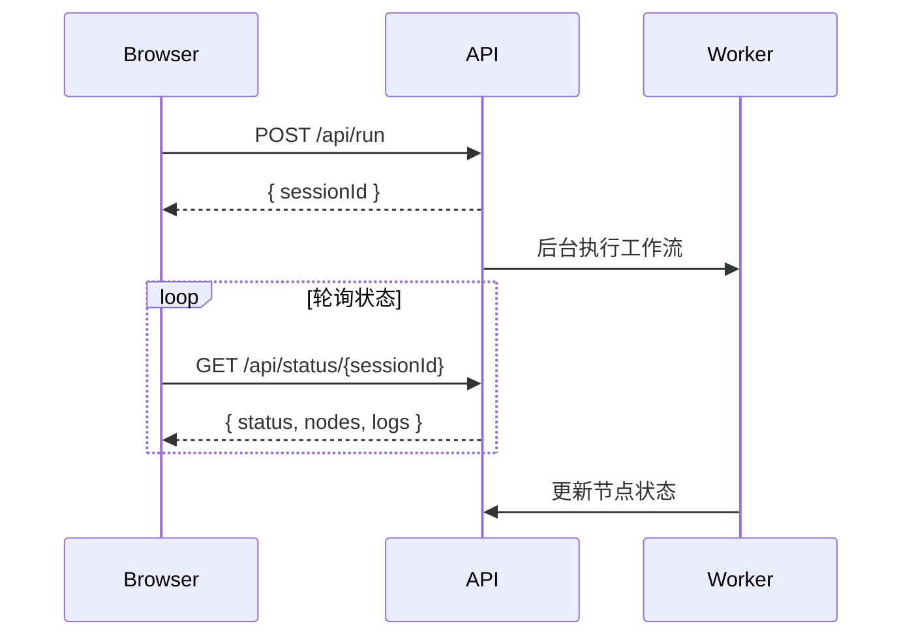

# ORC 代码逻辑说明文档

## 项目概述

ORC (Orchestration Runner) 是一个 JSON 驱动的任务编排工具，支持 DAG（有向无环图）工作流定义、条件分支、并行执行和实时状态更新。

**核心特性：**
- JSON Schema 驱动的工作流定义
- DAG 自动验证与拓扑排序
- 条件分支与动态路由（`condition.branches`）
- 并行执行组调度
- 节点重试机制（支持指数退避）
- 实时状态更新（Web UI）
- 审计日志记录

---

## 核心架构

```
┌─────────────────────────────────────────────────────────────────┐
│                         CLI Layer (cli.ts)                       │
│  ┌─────────────────┬─────────────────┬─────────────────────┐    │
│  │ run 命令        │ validate 命令   │ serve 命令          │    │
│  └────────┬────────┴────────┬────────┴──────────┬──────────┘    │
│           │                  │                   │               │
└───────────┼──────────────────┼───────────────────┼───────────────┘
            │                  │                   │
┌───────────▼──────────────────▼───────────────────▼───────────────┐
│                      Core Layer                                   │
│  ┌──────────────────────────────────────────────────────────┐    │
│  │  WorkflowGraph (Graph.ts)                                 │    │
│  │  - DAG 构建与验证                                          │    │
│  │  - 拓扑排序                                                │    │
│  │  - 并行组计算                                              │    │
│  └──────────────────────────────────────────────────────────┘    │
│  ┌──────────────────────────────────────────────────────────┐    │
│  │  Executor (Executor.ts)                                   │    │
│  │  - 节点调度与执行                                          │    │
│  │  - 条件分支评估                                            │    │
│  │  - 重试机制                                                │    │
│  │  - 输入/输出验证                                           │    │
│  └──────────────────────────────────────────────────────────┘    │
└───────────────────────────────────────────────────────────────────┘
            │
┌───────────▼──────────────────────────────────────────────────────┐
│                      Node Layer                                   │
│  ┌────────────┐  ┌────────────┐  ┌────────────┐  ┌────────────┐  │
│  │ BashNode   │  │ PythonNode │  │ NodeNode   │  │ LoopNode   │  │
│  └────────────┘  └────────────┘  └────────────┘  └────────────┘  │
│  ┌──────────────────────────────────────────────────────────┐    │
│  │  ClaudeCodeNode (含 ConversationExporter)                │    │
│  └──────────────────────────────────────────────────────────┘    │
└───────────────────────────────────────────────────────────────────┘
            │
┌───────────▼──────────────────────────────────────────────────────┐
│                      Runtime Layer                                │
│  ┌────────────────────┐  ┌────────────────────────────────────┐  │
│  │ AuditLogger        │  │ GlobalContext (Web UI 状态)        │  │
│  │ types.ts / schema.ts │  │ ClaudeExporterWorker (后台线程)   │  │
│  └────────────────────┘  └────────────────────────────────────┘  │
└───────────────────────────────────────────────────────────────────┘
```

---

## 命令执行流程

### 1. `run` 命令流程

```
用户执行
  │
  ▼
┌─────────────────────────────────────┐
│ 1. 加载工作流 JSON                   │
│    - 读取文件                        │
│    - JSON.parse 解析                 │
└─────────────────────────────────────┘
  │
  ▼
┌─────────────────────────────────────┐
│ 2. 构建 WorkflowGraph                │
│    - Schema 验证                      │
│    - 添加节点到图                     │
│    - 添加边到图（to + branches）       │
│    - DAG 校验（无环）                  │
│    - 输入覆盖校验                     │
└─────────────────────────────────────┘
  │
  ▼
┌─────────────────────────────────────┐
│ 3. 准备 ExecutionContext             │
│    - workflowDir                     │
│    - outputDir                       │
│    - auditDir                        │
│    - tempBaseDir                     │
│    - sessionId                       │
└─────────────────────────────────────┘
  │
  ▼
┌─────────────────────────────────────┐
│ 4. 创建 Executor 并注册节点执行器     │
│    - BashNode                        │
│    - PythonNode                      │
│    - NodeNode                        │
│    - ClaudeCodeNode                  │
└─────────────────────────────────────┘
  │
  ▼
┌─────────────────────────────────────┐
│ 5. Executor.execute()                │
│    - 初始化目录                       │
│    - 获取 root 节点 (getRootNodes)    │
│    - 事件驱动执行                     │
└─────────────────────────────────────┘
  │
  ├───────────────────────────────────┐
  │ 事件驱动执行模型                   │
  │                                   │
  │ 1. 执行所有 root 节点 (入度为 0)      │
  │    └─→ 并行启动                    │
  │                                   │
  │ 2. 节点完成后广播                  │
  │    └─→ 通知所有下游节点           │
  │                                   │
  │ 3. 下游节点检查上游                │
  │    ├─ 所有上游完成 → 执行         │
  │    └─ 仍有未完成 → 继续等待       │
  │                                   │
  │ ▼ 对每个节点                        │
  │ ┌───────────────────────────────┐ │
  │ │ executeNode() + 重试循环       │ │
  │ │  ┌─────────────────────────┐  │ │
  │ │  │ executeNodeInternal()   │  │ │
  │ │  │  1. collectInputs()     │  │ │
  │ │  │     - 收集入边源节点输出  │  │ │
  │ │  │     - 评估条件边         │  │ │
  │ │  │     - 检测孤立节点       │  │ │
  │ │  │  2. validateInputs()    │  │ │
  │ │  │     - Ajv Schema 验证     │  │ │
  │ │  │  3. executor.execute()  │  │ │
  │ │  │     - 调用节点执行器     │  │ │
  │ │  │  4. processOutput()     │  │ │
  │ │  │     - outputMapping     │  │ │
  │ │  │  5. validateOutput()    │  │ │
  │ │  │  6. persistOutput()     │  │ │
  │ │  │  7. audit.complete()    │  │ │
  │ │  └─────────────────────────┘  │ │
  │ └───────────────────────────────┘ │
  └───────────────────────────────────┘
  │
  ▼
┌─────────────────────────────────────┐
│ 6. 输出结果                          │
│    - 打印节点输出到终端              │
│    - 显示 output/audit 目录路径       │
└─────────────────────────────────────┘
```

### 2. `validate` 命令流程

```
用户执行
  │
  ▼
┌─────────────────────────────────────┐
│ 1. 加载工作流 JSON                   │
└─────────────────────────────────────┘
  │
  ▼
┌─────────────────────────────────────┐
│ 2. 构建 WorkflowGraph                │
│    - 执行完整校验流程                │
└─────────────────────────────────────┘
  │
  ▼
┌─────────────────────────────────────┐
│ 3. 输出校验结果                      │
│    - ✓ Workflow is valid            │
│    - Nodes: N                       │
│    - Execution order: A → B → C     │
└─────────────────────────────────────┘
```

### 3. `serve` 命令流程

```
用户执行
  │
  ▼
┌─────────────────────────────────────┐
│ 1. 可选：加载工作流 JSON             │
│    - 存储到 GLOBAL_CONTEXT           │
│      .lastWorkflow                   │
└─────────────────────────────────────┘
  │
  ▼
┌─────────────────────────────────────┐
│ 2. 启动 HTTP 服务器                   │
│    - 原生 Node.js http               │
│    - 监听指定端口                     │
│    - 提供静态 HTML (src/web/)        │
└─────────────────────────────────────┘
  │
  │ HTTP 请求处理
  ├───────────────────────────────────────────────────┐
  │                                                   │
  │ GET  / 或 /index.html                            │
  │   → 返回 index.html (Cytoscape UI)                │
  │                                                   │
  │ GET  /api/workflow                                │
  │   → 返回 lastWorkflow JSON                        │
  │                                                   │
  │ POST /api/run?cleanOldFiles=&sessionId=           │
  │   ├─ 生成 sessionId                               │
  │   ├─ 创建 execution state                         │
  │   └─ 后台执行 runWorkflow() (异步)                │
  │                                                   │
  │ POST /api/node/run?nodeId=&single=&sessionId=     │
  │   └─ 单节点调试执行                               │
  │                                                   │
  │ GET  /api/status/{sessionId}                      │
  │   → 返回 { status, logs, nodes }                  │
  │                                                   │
  └───────────────────────────────────────────────────┘
```

**GlobalContext 全局状态：**
```typescript
class GlobalContext {
  lastWorkflow: WorkflowDefinition | null = null;
  executionStates = new Map<string, ExecutionState>();
  executions = new Map<string, Executor>();
}
export const GLOBAL_CONTEXT = new GlobalContext();
```

---

## 命令共用逻辑

**`run` 和 `serve` 命令都使用 `runWorkflow()` 函数：**

```typescript
// cli.ts 中的统一执行函数
async function runWorkflow(
  workflow: WorkflowDefinition,
  options: any,
  sessionId: string,
  workflowDir: string
) {
  // 1. 初始化目录
  // 2. 构建 WorkflowGraph(workflow, workflowDir)
  // 3. 创建 Executor
  // 4. 注册节点执行器
  // 5. 按并行组执行，实时更新状态
  // 6. 记录日志到 state.logs
}
```

**`run` 命令的简化调用：**
```typescript
program.command('run <workflow>').action(async (workflowPath, options) => {
  const workflow = JSON.parse(await fs.readFile(workflowPath));
  const workflowDir = path.dirname(path.resolve(workflowPath));
  const sessionId = `cli-${uuidv4()}`;
  
  // 调用统一的 runWorkflow 函数
  await runWorkflow(workflow, options, sessionId, workflowDir);
});
```

**好处：**
1. 代码复用，减少重复
2. 确保 CLI 和 Web UI 执行逻辑一致
3. 修复 `$ref` 引用问题（传递 workflowDir）
4. 统一的日志格式和状态追踪

---

## 核心模块详解

### WorkflowGraph (Graph.ts)

**职责：** DAG 构建、校验、拓扑排序

**关键方法：**

| 方法 | 功能 |
|------|------|
| `build()` | 构建图，添加节点和边（to + branches） |
| `validateGraphSchema()` | 校验工作流 JSON Schema |
| `validateDAG()` | 校验无环（topologicalSort） |
| `validateSchemaConnections()` | 校验输入覆盖 |
| `getExecutionOrder()` | 返回拓扑排序 |
| `getRootNodes()` | 返回入度为 0 且出度 > 0 的节点 |
| `getDirectUpstreamNodes()` | 返回直接前驱节点 |
| `getDirectDownstreamNodes()` | 返回直接后继节点 |
| `getAllDownstreamNodes()` | 返回所有下游节点（BFS） |
| `getAllValidNodes()` | 返回所有非孤立节点 |
| `getParallelGroups()` | 按层级返回并行组 |
| `getIncomingEdges()` | 返回节点入边（含条件信息） |

**边处理逻辑：**
```typescript
// 1. 默认边 (edge.to)
if (edge.to) {
  graph.addDirectedEdge(edge.from.nodeId, edge.to.nodeId, {...})
}

// 2. 条件分支边 (edge.condition.branches)
if (edge.condition?.branches) {
  for (const branch of edge.condition.branches) {
    graph.addDirectedEdge(edge.from.nodeId, branch.to.nodeId, {...})
  }
}
```

---

### Executor (Executor.ts)

**职责：** 节点调度、条件评估、重试执行（事件驱动 + 下游传播模型）

**关键字段：**
```typescript
private nodes: Map<string, NodeInstance>;      // 运行时节点状态
private workflowStopped: boolean;               // 工作流停止标志
private executors: Map<string, NodeExecutor>;   // 节点执行器注册表
```

**关键流程：**

1. **事件驱动执行**
```typescript
// Executor.execute() - 两种模式
if (!debugContext.startNodeId) {
  await this.newExecute(context, state);   // 全量执行
} else {
  await this.startFrom(context, state, nodeId, single);  // 调试恢复
}

// newExecute: 初始化所有 NodeInstance，并行启动根节点
this.graph.getAllValidNodes().forEach(id => this.initNodeInstance(id));
await Promise.all(this.graph.getRootNodes().map(id =>
  this.executeNode(id, 'root', context, state)
));

// executeNode: 每节点独立 Mutex，成功后触发下游
node.lock.runExclusive(async () => {
  // 1. 等待所有上游完成（从文件加载缓存输出）
  for (const [dependId, completed] of node.depends.entries()) {
    if (!completed) await this.loadFromFile(this.getOutputFilePath(dependId), ...);
  }
  // 2. 执行节点
  await this.executeNodeInternal(...);
  node.status = 'success';
  // 3. 触发下游
  if (!single) {
    await Promise.all(this.graph.getDirectDownstreamNodes(nodeId).map(id =>
      this.executeNode(id, nodeId, context, state)
    )).catch(() => {});
  }
});
```

2. **幂等执行（输出缓存）**
```typescript
// executeNodeInternal 第一步：检查输出文件是否存在
const outputFilePath = this.getOutputFilePath(nodeId);
try {
  await this.loadFromFile(outputFilePath, nodeId, auditEntry);
  return;  // 缓存命中，直接返回成功
} catch { /* 文件不存在，继续正常执行 */ }
```

3. **调试恢复模式（startFrom）**
```typescript
// 从指定节点开始执行，预加载上游缓存
this.graph.getAllDownstreamNodes(startNodeId).forEach(id => this.initNodeInstance(id));
await Promise.all(this.graph.getDirectUpstreamNodes(startNodeId).map(async upstreamId => {
  await this.loadFromFile(this.getOutputFilePath(upstreamId), upstreamId, auditEntry)
    .then(() => node.depends.set(upstreamId, true));  // 标记依赖为已满足
}));
await this.executeNode(startNodeId, 'root', context, state);
```

4. **节点重试循环**
```typescript
for (let attempt = 1; attempt <= maxAttempts; attempt++) {
  try {
    await this.executeNodeInternal(...);
    return; // 成功
  } catch (error) {
    if (attempt < maxAttempts) {
      // 指数退避：delay = baseDelay * 2^(attempt-1)
      await new Promise(resolve => setTimeout(resolve, delay));
    }
  }
}
```

3. **条件边评估**
```typescript
// collectInputs(): 遍历入边，评估条件
for (const edge of edges) {
  if (edge.condition) {
    const result = this.evaluateEdgeCondition(edge, node.id);
    if (result.action === 'stop') { this.workflowStopped = true; throw... }
    if (result.action === 'skip') continue;  // 跳过此边
    if (result.action === 'skip-node') throw new Error(...)
    if (result.action === 'route') {
      if (result.target.nodeId !== node.id) continue;  // 当前节点不在路由目标中
    }
  }
  // 收集上游输出
  inputs[edge.input] = this.context.nodeOutputs.get(edge.from);
}
// 所有边都被跳过 → 跳过节点
if (!hasActiveEdge || Object.keys(inputs).length === 0) {
  throw new NodeSkippedError(node.id);
}
```

5. **孤立节点和跳过处理**
```typescript
// collectInputs(): 孤立节点检测
if (incomingEdges.length === 0 && outgoingEdges.length === 0) {
  throw new NodeSkippedError(node.id);  // 完全无连接的孤立节点
}

// executeNode(): 跳过节点处理
if (error instanceof NodeSkippedError) {
  this.audit.skipped(auditEntry);
  this.context.nodeOutputs.set(nodeId, { __skipped: true });  // 标记跳过
  node.status = 'skipped';
  return;  // 不重试
}

// collectInputs(): 上游被跳过
if (sourceOutput?.__skipped === true) {
  continue;  // 跳过此边的输入传播
}
```

6. **节点重试循环**
```typescript
for (let attempt = 1; attempt <= maxAttempts; attempt++) {
  try {
    await this.executeNodeInternal(...);
    return; // 成功
  } catch (error) {
    if (error instanceof NodeSkippedError) { /* 不重试，直接跳过 */ }
    if (attempt < maxAttempts) {
      // 指数退避：delay = baseDelay * 2^(attempt-1)
      await new Promise(resolve => setTimeout(resolve, delay));
    }
  }
}
```

---

### 节点执行器接口

```typescript
interface NodeExecutor {
  execute(
    node: NodeDefinition,
    inputs: Record<string, any>,
    context: ExecutionContext
  ): Promise<any>;
}
```

**已实现执行器：**
- `BashNode` - 执行 Bash 脚本（stdin/args/file 传参、envMapping、Handlebars 模板）
- `PythonNode` - 执行 Python 脚本（支持 requirements）
- `NodeNode` - 执行 Node.js 脚本（支持 runtime 切换）
- `ClaudeCodeNode` - 调用 Claude Code AI（prompt 模板、JSON Schema 约束、resume 重试）
- `LoopNode` - 循环子图执行（subGraph + validator 动态校验）

---

## 数据结构

### WorkflowDefinition
```typescript
{
  version: string;
  name: string;
  description?: string;
  schemaBaseDir?: string[];   // 自动加载 schema 文件目录
  schemas?: Record<string, { file?: string; content?: JSONSchema7 }>;  // Schema 定义
  nodes: NodeDefinition[];
  edges: EdgeDefinition[];
}
```

### NodeDefinition
```typescript
{
  id: string;
  type: 'bash' | 'python' | 'node' | 'claude-code' | 'loop';
  name: string;
  description?: string;
  inputs: Record<string, JSONSchema7>;
  output: { ref: string; schema: JSONSchema7 };
  config: NodeConfigUnion;
}
```

### EdgeDefinition
```typescript
{
  id: string;
  from: { nodeId: string };
  to?: { nodeId: string; input: string };  // 可选
  condition?: {
    branches: [{
      expression: string;
      to: { nodeId: string; input: string };
    }];
    onNoMatch?: 'skip' | 'skip-node' | 'stop' | 'error';
  };
}
```

---

## LoopNode 循环子图

**LoopNode 将父图 + subGraph 合并构建新 WorkflowGraph，循环执行直到 validator 通过：**
```typescript
// 合并父图节点和 subGraph 节点
const graph = new WorkflowGraph({
  nodes: [...workflowDef.nodes, ...config.subGraph.nodes],
  edges: config.subGraph.edges,
  schemas: { ...workflowDef.schemas, ...config.subGraph.schemas }
}, context.workflowDir);

// 每次迭代使用独立目录
for (let attempt = 1; attempt <= maxAttempts; attempt++) {
  const subContext = {
    ...context,
    outputDir: `${outputDir}/${nodeId}-${attempt}`,
    auditDir: `${auditDir}/${nodeId}-${attempt}`,
    tempBaseDir: `${tempBaseDir}/${nodeId}-${attempt}`,
    nodeOutputs: new Map()
  };
  const executor = new Executor(graph, subContext, {
    ...inputs,
    __lastIterationOutput: lastOutputs  // 传递上次迭代输出
  });
  await executor.execute(subContext, subExecutionState);

  const validator = new Function('outputs', `return ${config.validator}`);
  if (validator(Object.fromEntries(subContext.nodeOutputs))) return lastOutputs;
}
throw new Error(`All ${maxAttempts} attempts failed validation`);
```

---

## Claude 对话导出

### ConversationExporter
- 解析 `.jsonl` 格式的 Claude 对话记录
- 支持 HTML/Markdown 两种导出格式
- 自动检测并内联 subagent 执行详情（通过 agentId 或时间戳匹配）
- 长文本可折叠，Markdown 自动渲染

### ClaudeExporterWorker
- 后台 Worker 线程，每 5 秒轮询
- 监听主线程 add/remove 任务消息
- 自动导出 `~/.claude/projects/` 下的对话记录
- 支持 cleanOldFiles 清理过期 HTML

---

## GlobalContext 全局状态

```typescript
class GlobalContext {
  lastWorkflow: WorkflowDefinition | null = null;   // Web UI 当前工作流
  executionStates = new Map<string, ExecutionState>();  // sessionId → 执行状态
  executions = new Map<string, Executor>();              // sessionId → Executor
}
export const GLOBAL_CONTEXT = new GlobalContext();
```

- CLI `run` 命令和 `serve` 命令共享同一个 GlobalContext 实例
- `serve` 命令的 HTTP handler 通过 GlobalContext 访问工作流和状态
- Web UI 轮询 `/api/status/:sessionId` 获取实时状态

---

## Schema 文件加载

**schemaBaseDir 自动加载：**
```json
{
  "schemaBaseDir": ["./schemas/complex"],
  "nodes": [{
    "id": "init",
    "output": { "ref": "init_out" }
  }]
}
```
`prepareSchema()` 自动扫描 schemaBaseDir 下所有 `.json` 文件，按文件名注册到 schemas。
节点 output.ref 和 inputs 通过 key 查找对应 schema content。

**内联 Schema：**
```json
{
  "schemas": {
    "my_output": {
      "file": "schemas/my_output.json"   // 从文件加载
    },
    "my_input": {
      "content": { "type": "object", ... }  // 内联定义
    }
  }
}
```

**实现位置：**
- `Graph.prepareSchema()` - 扫描 schemaBaseDir + 解析 schema.file
- `Graph.build()` - 将 schema 注入节点 output.schema 和 inputs
- `Executor` 使用 Ajv 校验输入/输出

---

## 状态流转

### 节点状态
```
pending → running → success
                     → failed
                     → skipped
```

### Web UI 轮询


---

## 文件结构

```
orc/
├── src/
│   ├── cli.ts              # CLI 入口（run/validate/serve）
│   ├── types.ts            # 类型定义（含 NodeType = bash|python|node|claude-code|loop）
│   ├── schema.ts           # JSON Schema（GRAPH_SCHEMA / WORKFLOW_SCHEMA）
│   ├── core/
│   │   ├── Graph.ts        # WorkflowGraph - DAG 构建与校验
│   │   └── Executor.ts     # Executor - 节点调度、条件评估、重试
│   ├── nodes/
│   │   ├── BashNode.ts         # Bash 执行器
│   │   ├── PythonNode.ts       # Python 执行器
│   │   ├── NodeNode.ts         # Node.js 执行器
│   │   ├── ClaudeCodeNode.ts   # Claude Code AI 节点
│   │   └── LoopNode.ts         # 循环子图节点
│   ├── runtime/
│   │   └── AuditLogger.ts  # 审计日志
│   ├── tools/
│   │   ├── ConversationExporter.ts   # 对话 HTML 导出
│   │   └── ClaudeExporterWorker.ts   # 后台 Worker 线程
│   ├── utils/
│   │   └── GlobalContext.ts  # Web UI 全局状态管理
│   └── web/
│       └── index.html      # Web UI (Cytoscape.js)
├── examples/               # 示例工作流
├── docs/
│   ├── CODE_LOGIC.md       # 本文档
│   ├── technical-design.md # 技术设计
│   └── iteration-plan.md   # 迭代计划
├── audit/                  # 审计日志输出
├── output/                 # 节点输出缓存
└── workspace/              # 临时工作目录
```

---

## 版本

- 当前版本：v0.6.0
- 主要特性：5 种节点类型、并行执行、条件分支、重试、幂等执行、Web UI、对话导出
