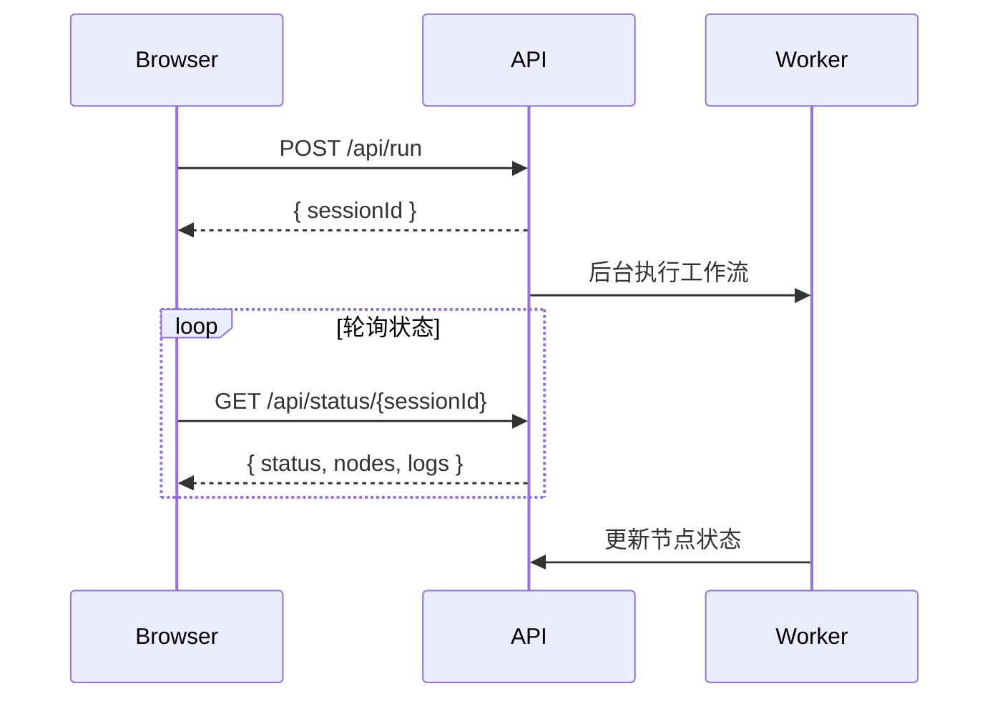

# ORC 代码逻辑说明文档

## 项目概述

ORC (Orchestration Runner) 是一个 JSON 驱动的任务编排工具，支持 DAG（有向无环图）工作流定义、条件分支、并行执行和实时状态更新。

**核心特性：**
- JSON Schema 驱动的工作流定义
- DAG 自动验证与拓扑排序
- 条件分支与动态路由（`condition.branches`）
- 并行执行组调度
- 节点重试机制（支持指数退避）
- 实时状态更新（Web UI）
- 审计日志记录

---

## 核心架构

```
┌─────────────────────────────────────────────────────────────────┐
│                         CLI Layer (cli.ts)                       │
│  ┌─────────────────┬─────────────────┬─────────────────────┐    │
│  │ run 命令        │ validate 命令   │ serve 命令          │    │
│  └────────┬────────┴────────┬────────┴──────────┬──────────┘    │
│           │                  │                   │               │
└───────────┼──────────────────┼───────────────────┼───────────────┘
            │                  │                   │
┌───────────▼──────────────────▼───────────────────▼───────────────┐
│                      Core Layer                                   │
│  ┌──────────────────────────────────────────────────────────┐    │
│  │  WorkflowGraph (Graph.ts)                                 │    │
│  │  - DAG 构建与验证                                          │    │
│  │  - 拓扑排序                                                │    │
│  │  - 并行组计算                                              │    │
│  └──────────────────────────────────────────────────────────┘    │
│  ┌──────────────────────────────────────────────────────────┐    │
│  │  Executor (Executor.ts)                                   │    │
│  │  - 节点调度与执行                                          │    │
│  │  - 条件分支评估                                            │    │
│  │  - 重试机制                                                │    │
│  │  - 输入/输出验证                                           │    │
│  └──────────────────────────────────────────────────────────┘    │
└───────────────────────────────────────────────────────────────────┘
            │
┌───────────▼──────────────────────────────────────────────────────┐
│                      Node Layer                                   │
│  ┌────────────┐  ┌────────────┐  ┌────────────┐  ┌────────────┐  │
│  │ BashNode   │  │ PythonNode │  │ NodeNode   │  │ ClaudeCode │  │
│  └────────────┘  └────────────┘  └────────────┘  └────────────┘  │
└───────────────────────────────────────────────────────────────────┘
            │
┌───────────▼──────────────────────────────────────────────────────┐
│                      Runtime Layer                                │
│  ┌────────────────────┐  ┌────────────────────────────────────┐  │
│  │ AuditLogger        │  │ types.ts / schema.ts               │  │
│  └────────────────────┘  └────────────────────────────────────┘  │
└───────────────────────────────────────────────────────────────────┘
```

---

## 命令执行流程

### 1. `run` 命令流程

```
用户执行
  │
  ▼
┌─────────────────────────────────────┐
│ 1. 加载工作流 JSON                   │
│    - 读取文件                        │
│    - JSON.parse 解析                 │
└─────────────────────────────────────┘
  │
  ▼
┌─────────────────────────────────────┐
│ 2. 构建 WorkflowGraph                │
│    - Schema 验证                      │
│    - 添加节点到图                     │
│    - 添加边到图（to + branches）       │
│    - DAG 校验（无环）                  │
│    - 输入覆盖校验                     │
└─────────────────────────────────────┘
  │
  ▼
┌─────────────────────────────────────┐
│ 3. 准备 ExecutionContext             │
│    - workflowDir                     │
│    - outputDir                       │
│    - auditDir                        │
│    - tempBaseDir                     │
│    - sessionId                       │
└─────────────────────────────────────┘
  │
  ▼
┌─────────────────────────────────────┐
│ 4. 创建 Executor 并注册节点执行器     │
│    - BashNode                        │
│    - PythonNode                      │
│    - NodeNode                        │
│    - ClaudeCodeNode                  │
└─────────────────────────────────────┘
  │
  ▼
┌─────────────────────────────────────┐
│ 5. Executor.execute()                │
│    - 初始化目录                       │
│    - 获取 root 节点 (getRootNodes)    │
│    - 事件驱动执行                     │
└─────────────────────────────────────┘
  │
  ├───────────────────────────────────┐
  │ 事件驱动执行模型                   │
  │                                   │
  │ 1. 执行所有 root 节点 (入度为 0)      │
  │    └─→ 并行启动                    │
  │                                   │
  │ 2. 节点完成后广播                  │
  │    └─→ 通知所有下游节点           │
  │                                   │
  │ 3. 下游节点检查上游                │
  │    ├─ 所有上游完成 → 执行         │
  │    └─ 仍有未完成 → 继续等待       │
  │                                   │
  │ ▼ 对每个节点                        │
  │ ┌───────────────────────────────┐ │
  │ │ executeNode() + 重试循环       │ │
  │ │  ┌─────────────────────────┐  │ │
  │ │  │ executeNodeInternal()   │  │ │
  │ │  │  1. collectInputs()     │  │ │
  │ │  │     - 收集入边源节点输出  │  │ │
  │ │  │     - 评估条件边         │  │ │
  │ │  │     - 检测孤立节点       │  │ │
  │ │  │  2. validateInputs()    │  │ │
  │ │  │     - Ajv Schema 验证     │  │ │
  │ │  │  3. executor.execute()  │  │ │
  │ │  │     - 调用节点执行器     │  │ │
  │ │  │  4. processOutput()     │  │ │
  │ │  │     - outputMapping     │  │ │
  │ │  │  5. validateOutput()    │  │ │
  │ │  │  6. persistOutput()     │  │ │
  │ │  │  7. audit.complete()    │  │ │
  │ │  └─────────────────────────┘  │ │
  │ └───────────────────────────────┘ │
  └───────────────────────────────────┘
  │
  ▼
┌─────────────────────────────────────┐
│ 6. 输出结果                          │
│    - 打印节点输出到终端              │
│    - 显示 output/audit 目录路径       │
└─────────────────────────────────────┘
```

### 2. `validate` 命令流程

```
用户执行
  │
  ▼
┌─────────────────────────────────────┐
│ 1. 加载工作流 JSON                   │
└─────────────────────────────────────┘
  │
  ▼
┌─────────────────────────────────────┐
│ 2. 构建 WorkflowGraph                │
│    - 执行完整校验流程                │
└─────────────────────────────────────┘
  │
  ▼
┌─────────────────────────────────────┐
│ 3. 输出校验结果                      │
│    - ✓ Workflow is valid            │
│    - Nodes: N                       │
│    - Execution order: A → B → C     │
└─────────────────────────────────────┘
```

### 3. `serve` 命令流程

```
用户执行
  │
  ▼
┌─────────────────────────────────────┐
│ 1. 可选：加载工作流 JSON             │
│    - 如果提供路径则加载              │
│    - 存储到 lastWorkflow             │
└─────────────────────────────────────┘
  │
  ▼
┌─────────────────────────────────────┐
│ 2. 启动 HTTP 服务器                   │
│    - 监听指定端口                    │
│    - 提供静态 HTML 资源               │
└─────────────────────────────────────┘
  │
  │ HTTP 请求处理
  ├───────────────────────────────────────────────────┐
  │                                                   │
  │ GET  /api/workflow                               │
  │   → 返回 lastWorkflow JSON                        │
  │                                                   │
  │ POST /api/run                                    │
  │   ├─ 生成 sessionId                              │
  │   ├─ 创建 execution state                        │
  │   └─ 后台执行 runWorkflow()                      │
  │       │                                           │
  │       ▼                                           │
  │   ┌───────────────────────────────────┐          │
  │   │ 构建 Graph + Executor              │          │
  │   └───────────────────────────────────┘          │
  │       │                                           │
  │       ▼                                           │
  │   ┌───────────────────────────────────┐          │
  │   │ 按并行组执行                       │          │
  │   │  - 更新 state.nodes[nodeId]       │          │
  │   │  - pending → running → success    │          │
  │   │                    ↓ failed       │          │
  │   │                    ↓ skipped      │          │
  │   └───────────────────────────────────┘          │
  │                                                   │
  │ GET  /api/status/{sessionId}                     │
  │   → 返回执行状态（含 nodes 状态 + logs）           │
  │                                                   │
  └───────────────────────────────────────────────────┘
```

---

## 命令共用逻辑

**`run` 和 `serve` 命令都使用 `runWorkflow()` 函数：**

```typescript
// cli.ts 中的统一执行函数
async function runWorkflow(
  workflow: WorkflowDefinition,
  options: any,
  sessionId: string,
  workflowDir: string
) {
  // 1. 初始化目录
  // 2. 构建 WorkflowGraph(workflow, workflowDir)
  // 3. 创建 Executor
  // 4. 注册节点执行器
  // 5. 按并行组执行，实时更新状态
  // 6. 记录日志到 state.logs
}
```

**`run` 命令的简化调用：**
```typescript
program.command('run <workflow>').action(async (workflowPath, options) => {
  const workflow = JSON.parse(await fs.readFile(workflowPath));
  const workflowDir = path.dirname(path.resolve(workflowPath));
  const sessionId = `cli-${uuidv4()}`;
  
  // 调用统一的 runWorkflow 函数
  await runWorkflow(workflow, options, sessionId, workflowDir);
});
```

**好处：**
1. 代码复用，减少重复
2. 确保 CLI 和 Web UI 执行逻辑一致
3. 修复 `$ref` 引用问题（传递 workflowDir）
4. 统一的日志格式和状态追踪

---

## 核心模块详解

### WorkflowGraph (Graph.ts)

**职责：** DAG 构建、校验、拓扑排序

**关键方法：**

| 方法 | 功能 |
|------|------|
| `build()` | 构建图，添加节点和边 |
| `validateWorkflowSchema()` | 校验工作流 JSON Schema |
| `validateDAG()` | 校验无环 |
| `validateSchemaConnections()` | 校验输入覆盖 |
| `getExecutionOrder()` | 返回拓扑排序 |
| `getRootNodes()` | 返回所有入度为 0 的节点（起始节点） |
| `getUpstreamNodes(nodeId)` | 返回节点的所有上游节点（直接前驱） |
| `getDownstreamNodes(nodeId)` | 返回节点的所有下游节点（直接后继） |
| `getIncomingEdges()` | 返回节点入边 |
| `getParallelGroups()` | 返回并行执行组（已废弃，仅供兼容） |

**边处理逻辑：**
```typescript
// 1. 默认边 (edge.to)
if (edge.to) {
  graph.addDirectedEdge(edge.from.nodeId, edge.to.nodeId, {...})
}

// 2. 条件分支边 (edge.condition.branches)
if (edge.condition?.branches) {
  for (const branch of edge.condition.branches) {
    graph.addDirectedEdge(edge.from.nodeId, branch.to.nodeId, {...})
  }
}
```

---

### Executor (Executor.ts)

**职责：** 节点调度、条件评估、重试执行（事件驱动模型）

**关键流程：**

1. **事件驱动执行**
```typescript
// 1. 获取所有 root 节点（入度为 0）并并行执行
const rootNodes = this.graph.getRootNodes();
const rootPromises = rootNodes.map(nodeId => this.executeNodeWithDownstreamTrigger(nodeId));
await Promise.all(rootPromises);

// 2. 节点完成后触发下游
async executeNodeWithDownstreamTrigger(nodeId: string) {
  await this.executeNode(nodeId);  // 执行节点（含重试）
  this.completedNodes.add(nodeId);  // 标记完成
  
  // 通知所有下游节点检查
  const downstreamNodes = this.graph.getDownstreamNodes(nodeId);
  for (const downstreamId of downstreamNodes) {
    this.checkAndTriggerNode(downstreamId);
  }
}

// 3. 下游节点检查并触发
checkAndTriggerNode(nodeId: string) {
  // 已执行或已安排的跳过
  if (completedNodes.has(nodeId) || pendingNodes.has(nodeId)) return;
  
  // 检查所有上游是否完成
  const upstreamNodes = this.graph.getUpstreamNodes(nodeId);
  const allUpstreamCompleted = upstreamNodes.every(id => completedNodes.has(id));
  
  if (allUpstreamCompleted) {
    // 所有上游完成，开始执行
    this.executeNodeWithDownstreamTrigger(nodeId);
  }
  // 否则继续等待
}
```

2. **节点重试循环**
```typescript
for (let attempt = 1; attempt <= maxAttempts; attempt++) {
  try {
    await this.executeNodeInternal(...);
    return; // 成功
  } catch (error) {
    if (attempt < maxAttempts) {
      // 指数退避：delay = baseDelay * 2^(attempt-1)
      await new Promise(resolve => setTimeout(resolve, delay));
    }
  }
}
```

3. **条件边评估**
```typescript
evaluateEdgeCondition(edge, nodeId) {
  // 1. 遍历 branches 评估表达式
  for (const branch of branches) {
    const result = Function('outputs', `return ${branch.expression}`)(outputs);
    if (result) {
      return { action: 'route', target: branch.to };
    }
  }
  
  // 2. 无匹配时使用 onNoMatch 配置
  switch (onNoMatch) {
    case 'skip': return { action: 'skip' };
    case 'skip-node': return { action: 'skip-node' };
    case 'stop': return { action: 'stop' };
    case 'error': return { action: 'error' };
    default: return { action: 'continue' };
  }
}
```

4. **孤立节点检测**
```typescript
// 节点无任何边连接时跳过
if (incomingEdges.length === 0 && outgoingEdges.length === 0) {
  throw new NodeSkippedError(node.id);
}
```

---

### 节点执行器接口

```typescript
interface NodeExecutor {
  execute(
    node: NodeDefinition,
    inputs: Record<string, any>,
    context: ExecutionContext
  ): Promise<any>;
}
```

**已实现执行器：**
- `BashNode` - 执行 Bash 脚本
- `PythonNode` - 执行 Python 脚本
- `NodeNode` - 执行 Node.js 脚本
- `ClaudeCodeNode` - 调用 Claude Code AI

---

## 数据结构

### WorkflowDefinition
```typescript
{
  version: string;
  name: string;
  description?: string;
  $defs?: Record<string, JSONSchema7>;  // Schema 定义（可选）
  nodes: NodeDefinition[];
  edges: EdgeDefinition[];
}
```

### NodeDefinition
```typescript
{
  id: string;
  type: 'bash' | 'python' | 'node' | 'claude-code';
  name: string;
  inputs: Record<string, JSONSchema7>;  // 支持 $ref 引用
  output: JSONSchema7;
  config: NodeConfigUnion;
}
```

### EdgeDefinition
```typescript
{
  id: string;
  from: { nodeId: string };
  to?: { nodeId: string; input: string };  // 可选
  condition?: {
    branches: [{
      expression: string;
      to: { nodeId: string; input: string };
    }];
    onNoMatch?: 'skip' | 'skip-node' | 'stop' | 'error';
  };
}
```

---

## Schema $ref 引用支持

**工作流内部引用：**
```json
{
  "$defs": {
    "status-mode": {
      "type": "object",
      "properties": {
        "status": { "type": "string" },
        "mode": { "type": "string" }
      }
    }
  },
  "nodes": [{
    "id": "start",
    "output": { "$ref": "workflow-schema#/$defs/status-mode" }
  }]
}
```

**外部文件引用：**
```json
{
  "nodes": [{
    "id": "process",
    "inputs": {
      "config": { "$ref": "schemas/types/config.json" }
    }
  }]
}
```

**实现位置：**
- `Graph.registerSchemas()` - 注册内部$defs 和外部 schema 文件
- `Executor` 复用 `Graph` 的 Ajv 实例进行验证

---

## 状态流转

### 节点状态
```
pending → running → success
                     → failed
                     → skipped
```

### Web UI 轮询


---

## 文件结构

```
orc/
├── src/
│   ├── cli.ts              # CLI 入口（run/validate/serve）
│   ├── types.ts            # 类型定义
│   ├── schema.ts           # JSON Schema 定义
│   ├── core/
│   │   ├── Graph.ts        # DAG 构建与校验
│   │   └── Executor.ts     # 节点调度与执行
│   ├── nodes/
│   │   ├── BashNode.ts     # Bash 执行器
│   │   ├── PythonNode.ts   # Python 执行器
│   │   ├── NodeNode.ts     # Node.js 执行器
│   │   └── ClaudeCodeNode.ts
│   ├── runtime/
│   │   └── AuditLogger.ts  # 审计日志
│   └── web/
│       └── index.html      # Web UI
├── schemas/types/          # 可复用 Schema 定义
│   ├── status-mode.json
│   ├── result.json
│   └── ...
├── examples/               # 示例工作流
└── docs/
    └── CODE_LOGIC.md       # 本文档
```

---

## 版本

- 当前版本：v0.6.0
- 主要特性：条件分支、并行执行、Schema $ref 引用
